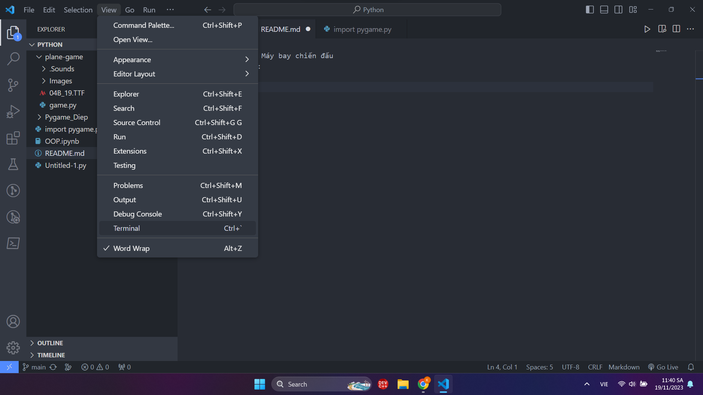
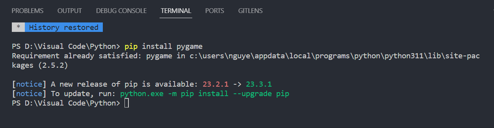
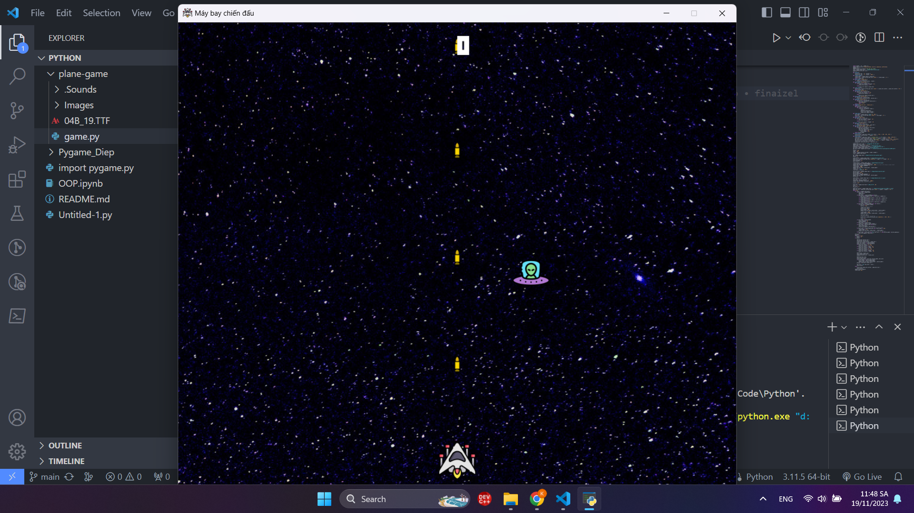

# NAME GAME: Máy bay chiến đấu
## MENTOR: 
Đặng Tuấn Điệp
## THÀNH VIÊN:
1. Nguyễn Tiến Trọng 
2. Nguyễn Thế Khiêm
3. Minh Danh
4. Bùi Văn
5. Phan Đức Hải
6. Tuấn Đặng
## Ý TƯỞNG VÀ ĐỀ TÀI:
- Ý tưởng: “Máy bay chiến đấu” là một tựa game sinh tồn trong đó người chơi vào vai nhân vật điều khiển phi thuyền để tấn công các tên lửa ngoài hành tinh.
- Đề tài: Bao gồm việc xây dựng bối cảnh là không gian vũ trụ với hàng ngàn vì sao trong đó người chơi sử dụng các phím W,A,S,D để điều hướng di chuyển. Ngoài ra game cũng tập trung vào việc tính điểm và thu thập items để tăng tính hấp dẫn. 
## CÁCH CÀI ĐẶT:
1. Mở cmd trên máy tính để cài đặt

2. Đứng ở folder muốn cài đặt và nhập dòng lệnh ‘git clone https://github.com/trong269/plane-game.git’. Đợi khoảng 1p để tải project về máy.
3. Mở IDE (VScode,...) để sử dụng, mở terminal và đứng ở folder đã cài đặt project.
Nhập vào terminal ‘pip install pygame’ để có thể chạy pygame trên VSCode.

4. Tiếp theo chạy code là sẽ hiện ra game để mọi người trải nghiệm.

5. Tiếp theo chạy code là sẽ hiện ra game để mọi người trải nghiệm.

## NGUỒN THAM KHẢO
Lấy cảm hứng từ tựa game: Space Invaders
